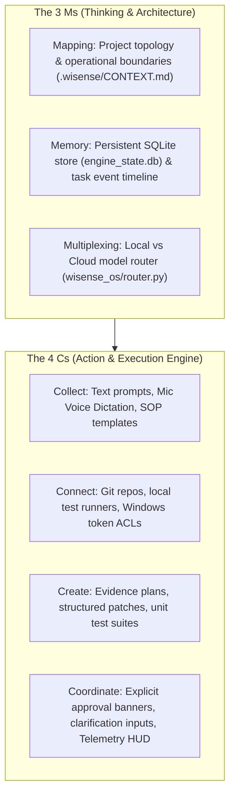

# WiSense OS — AI Operating System (AIOS) Master Plan & Architecture Blueprint

This document details the complete architectural blueprint and operational guidelines for **WiSense OS**, incorporating the enterprise **AI Operating System (AIOS)** principles derived from Nate Herkelman's 3 Ms and 4 Cs frameworks.

---

## 1. Vision & Core Principles

WiSense OS is a single, local-first Windows desktop operating center designed to automate software development, code quality audits, and business operational tasks securely.

### Fundamental Rules:
1. **Local-First Default**: Local Ollama models (`qwen2.5-coder:7b`) handle zero-cost routing, chat, and lightweight editing.
2. **Supervised Cloud Assistance**: Cloud models (`claude-3-7-sonnet`, `gemma4:31b-cloud`) act as optional specialists reached only through explicit user approval, redaction, and cost accounting.
3. **Engine as Single Authority**: The Python Engine (`wisense_os`) on `http://127.0.0.1:5050` is the **only** process allowed to access project files, run tests, or execute model calls.
4. **Plan-Bound Safety**: Code changes are backed by reviewed plans (`draftTaskPlan`) and scoped Git commits.

---

## 2. The AIOS Framework Architecture

WiSense OS implements the **3 Ms** (Thinking Engine) and **4 Cs** (Action Engine):



---

## 3. Desktop Application Tabs & Features

WiSense OS provides a unified 5-tab interface:

| Tab | Feature | Description |
|---|---|---|
| **1. Engine Status** | System Health | Real-time status of `wisense-os` REST engine and installed model profiles. |
| **2. Task Composer** | Task Execution | Project picker, prompt box with **Mic Voice Dictation**, 3 operating modes (`Talk Only`, `Ask Before Changes`, `Local Autopilot`), and explicit handoff approval banner. |
| **3. Task History** | Timeline & Evidence | Master-detail task log, **Draft Plan Preview card** (affected files & acceptance criteria), and task cancellation control. |
| **4. Command View** | Operations HUD | Live VRAM allocation gauge, generation speed meter (`tok/s`), active run counters, and visual model qualification scorecard. |
| **5. SOP Workflows** | Automated SOPs | Pre-packaged agentic workflows (`Security & Quality Audit`, `Unit Test Suite Boost`, `Module Optimization`, `API Documentation Generator`). |

---

## 4. Engine REST API Contract

The Python Engine exposes versioned endpoints at `http://127.0.0.1:5050`:

- `GET /api/v1/health` — Returns engine status and version.
- `GET /api/v1/models` — Returns active model profiles and cloud/local status.
- `GET /api/v1/projects` & `POST /api/v1/projects` — List and register project roots.
- `POST /api/v1/projects/context` — Auto-generates or reads `.wisense/CONTEXT.md` memory context.
- `POST /api/v1/tasks` — Submits a new task request.
- `GET /api/v1/tasks/{id}` — Retrieves task status, stage, and ordered event sequence.
- `POST /api/v1/tasks/{id}/approve` — Accepts explicit user approval for handoff.
- `POST /api/v1/tasks/{id}/cancel` — Cancels an in-flight or waiting task.
- `POST /api/v1/tasks/{id}/plan-draft` — Generates evidence plan prior to execution.
- `POST /api/v1/tasks/{id}/provider-input` — Submits human clarification response.
- `POST /api/v1/router/recommend` — Recommends model pairing based on task complexity.
- `GET /api/v1/sops` — Lists built-in agentic SOP workflow templates.
- `GET /api/v1/telemetry` — Returns live compute hardware and model qualification metrics.

---

## 5. Persistent File Structure

```text
C:\development\projects\wisense-os\
├── start_wisense_os.ps1         # One-Click Windows PowerShell launcher
├── run_engine.py                # Python Engine entrypoint with socket port check
├── AIOS_MASTER_PLAN.md          # This document (AIOS master architecture)
├── AUDIT_CHECKLIST.md           # Operational compliance checklist for future builds
├── WISENSE_OS_MASTER_PLAN.md   # Initial project master plan
├── wisense_os/                  # Standalone Python Engine package
│   ├── api.py                   # Flask REST API implementation
│   ├── bootstrap.py             # Windows token lockfile & engine setup
│   ├── context.py               # Project Context & Memory Engine
│   ├── router.py                # Multi-Model Multiplexer & Router
│   ├── skills.py                # SOP & Skill Workflow Engine
│   ├── store.py                 # SQLite task & event persistence
│   └── patch_executor.py        # Plan-bound patch executor & test runner
├── client/                      # Flutter Desktop Application
│   ├── lib/
│   │   ├── main.dart            # 5-Tab Navigation Layout
│   │   ├── core/engine/         # EngineClient & typed Dart models
│   │   └── features/            # Feature controllers & UI screens
│   └── test/                    # Comprehensive widget & unit test suite
└── tests/                       # Pytest unit & integration test suite (108 tests)
```
